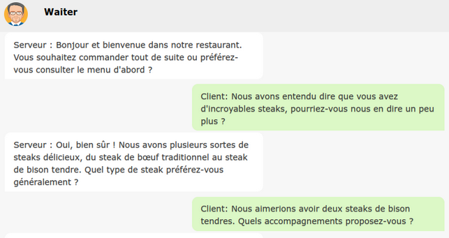

# 2023-languagelearning

## Project description

The Language Learning project provides a chatbot platform aimed at improving users' language skills. The main goal is to offer the user a chatbot interlocutor tailored for his preferred language and proficiency level. For the fully customizable learning experience the user can choose the situation in which he wishes to converse.

A more detailed description is available in a [blog post](https://blog.doxray.com/p/linguaai-ai-powered-personalized). 



## Running locally

To run the application locally, after cloning the repository, the following has to be executed:

- installing the requirements in the virtual environment by running ```$ pip install -r requirements.txt```
- setting up OpenAI API key by running ```$ echo OPENAI_API_KEY = \'your_key\' > keys.py```

### Customization

Current project uses the GPT-3.5-turbo model with the following parameters:

- temperature = 0.7
- max_tokens = 800
- top_p = 0.95
- frequency_penalty = 0
- presence_penalty = 0
- stop = None

If you wish to change the model used or the parameters, you can do so by altering the ```default_parameters``` variable in the ```src/parameters.py``` file. If you wish to change the prompt templates for a bot, add a new prompt template to template list that can be found in folder ```src/templates``` and instantiate the respective bot with the template index as an argument (see respective bot implementation and constructor arguments).

The application is available as a CLI app and as a web app.


### CLI application

To run the CLI app, run ```$ python chat.py```

The CLI app supports a having a single unpersisted chat, based on the user's input of the. Its primary function is to test new functionalities of the chatbot and auxiliary refinement bots.

### Flask web application

To run the web app, run ```$ python app.py```. The app starts on port 3000. The port can be modified in the ```app.py``` file.

Features available to users from thw web app are:

1. creating and persisting a new chat by choosing a language, language proficiency level and setting the dialogue should be carried out in,
2. fetching and browsing previously created dialogues,
3. sending and persisting new messages to created dialogues.

The chats are persisted in a CSV file ```db/messages.csv```.

## Implementation

The chatbot is implemented using prompt engineering techinques. The process of starting and conducting the dialogue consists of several parts:

1. Setting description assessment
2. Role inference
3. Initial GPT response generation
4. Refinement of the initial GPT response in the refinement pipeline

### Setting assessment

The setting user can describe is completely arbitrary and therefore, the assessment of user input is performed using the class ```InputValidationBot```. The aim is to assess that the user input falls into one of the three categories: a place, situation or activity.

If the setting description passes the assessment, the role inference process begins. For instance, the setting "In a restaurant" is expected to pass the assessment.

If the setting description doesn't pass the assessment, a suitable message is desplayed to the user and he needs to repeat the setting description. Settings "What do you want?" or "12HHwas" are not expected to pass the assessment.

### Role inference

To be able to carry out the dialogue, the implementation needs to infer two roles, one assigned to GPT and other to user, from the valid setting description. For instance, a sensible role inference process for the setting "In a restaurant" would assign the role "Waiter" to GPT and the role "Customer" to user. 

### Refinement pipeline

The refinement pipeline consists of refinement bots:

1. RoleFitnessBot - improving the role fitness of the input sentence
2. LanguageLevelBot - improving the language level to match the chosen level
3. LanguageLevelSimplificationBot - further simplifying the sentence (only for A1 and A2 levels of proficiency)

Visualisation of the previously described process is available as a flow diagram in ```./diagrams``` folder.

The implementation offers a stateful and stateless implementation of the same component.

#### Refinement bot prompt alternatives

In order to assess the quality and performance of different prompt alternatives, two evaluator bots have been developed, focusing on assessing the role fitness and language level match. Thee implementation can be found in ```src/bots/evaluation_bot.py``` file.

### Stateful components

- Thread - API wrapper class that keeps the record of previous messages
- ChatBot - sends messages through the stateful Thread

The CLI application is based on stateful components.

### Stateless components

- SingleRunThread - API wrapper class that sends a single prompt string, the record of messages is not kept (used for refinement bots)
- StatelessThread - API wrapper class that sends a list of messages to the API, the list is not persisted
- StatelessChatBot - sends messages through the StatelessThread

The web application is based on stateless components.

## Features in progress

1. SummarizationBot
   1. Problem: The API has a limit on number at tokens that can, in case of lenghty dialogue, be exceeded.
   2. Solution proposition: Periodically summarize previous dialogue and use the summary and a small window of most recent messages to generate new responses.
2. UserEngagementBot
   1. Problem: The model generates close ended responses, making it hard for the user to produce an answer.
   2. Solution proposition: Refine the responses to incite more user engagement and create open ended situations.
3. RoleFitnessLanguageLevelBot
   1. Problem: Making several API calls takes a significant toll on the latency of the chatbot responses
   2. Solution proposition: Integrate more refinements into a single refinement and therefore, into a single API call.

## Future improvements

1. Text-to-speech and speech-to-text integration
2. Authentication and authorization
3. Improving on persistence
4. User profile
5. User improvement suggestions (profile analysis)
6. User feedback
7. Reducing the number of API calls
